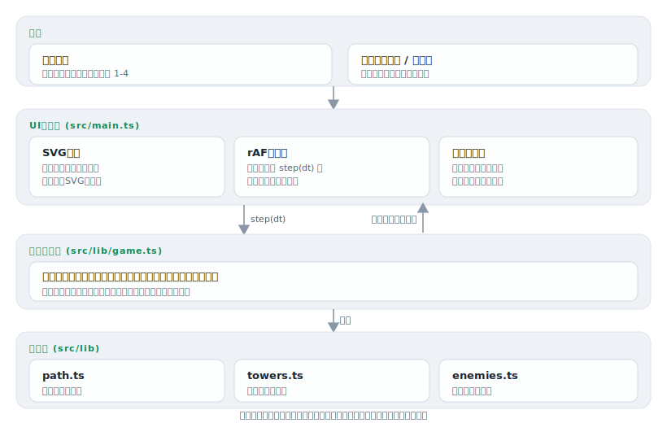

# mamori

[](https://github.com/miruky/mamori/actions/workflows/ci.yml)
[](https://github.com/miruky/mamori/actions/workflows/deploy.yml)
[](https://www.typescriptlang.org/)
[](LICENSE)

**経路を進む敵の波を、4種の塔を置いて迎え撃つタワーディフェンス。盤面・塔・敵・弾はすべてSVGで描く。全12ウェーブを守りきれるか**

デモ: https://miruky.github.io/mamori/

## 概要

mamoriは、決まった経路を端から端へ歩く敵を、道沿いに塔を建てて食い止めるタワーディフェンスである。敵を倒すと資金が増え、その資金で塔を増やし、強化する。1体でも出口まで抜けると残機が減り、残機が尽きれば敗北。全12ウェーブを凌ぎきれば勝ちになる。

塔は4種類あり、役割が違う。連射の利く主力のアロー塔、着弾点の周囲も巻き込む砲塔、敵を鈍らせる氷塔、遠くから一撃の重い狙撃塔。どれをどこに置くか、どれを強化するか、限られた資金の配分が勝敗を分ける。塔は売却して建て直すこともできる。

盤面・経路・塔・敵・弾は1枚のSVGに描かれ、敵のHPや鈍化、塔の射程もその場で見える。表示はベクターなので拡大しても粗くならず、ライト・ダークの配色にも追従する。

### なぜ作ったのか

タワーディフェンスは、リアルタイムに見えて実は「どこに何を置くか」という配置の問題で、盤面さえ正しく見えれば理屈で攻略できる。そこをCanvasのピクセル描画ではなくSVGで組み、射程や経路といった幾何をそのまま図形として扱いたかった。あわせて、ゲームの中核を描画から切り離し、乱数を排して「同じ操作からは同じ展開」になる決定的なシミュレーションにすることで、挙動をテストで固められる作りを試した。

## アーキテクチャ



## 技術スタック

| カテゴリ             | 技術                                 |
| :------------------- | :----------------------------------- |
| 言語                 | TypeScript 5(strict、実行時依存ゼロ) |
| 描画                 | インラインSVG(DOM操作)               |
| ビルド               | Vite 8                               |
| テスト               | Vitest(node / jsdom)                 |
| リンタ・フォーマッタ | ESLint(typescript-eslint)+ Prettier  |
| CI / 配信            | GitHub Actions / GitHub Pages        |

## 遊び方

1. パレットか数字キー `1`-`4` で塔を選び、道の外の空きマスをクリックして設置する。
2. 「ウェーブ開始」で敵が湧き始める。敵を倒すと資金が入る。
3. 塔をクリックすると射程が表示され、強化や売却ができる。
4. 出口へ抜けられると残機が減る。残機を残したまま全ウェーブを退ければ勝ち。

難易度はやさしい・ふつう・むずかしいから選べる。難しいほど敵が硬く賞金が減り、残機も少ない。難易度ごとに最高到達ウェーブと勝利数を記録し、HUDの「最高」に現在の難易度の最高記録を出す。難易度・テーマ・戦績はブラウザに保存され、次回も引き継がれる。ウェーブの合間の局面(資金・残機・配置した塔)も自動保存され、ページを開き直すとその続きから再開する。

| 操作                       | キー・操作                                              |
| :------------------------- | :------------------------------------------------------ |
| 塔を選ぶ                   | パレット、または `1` `2` `3` `4`                        |
| 塔を置く                   | 空きマスをクリック / タップ                             |
| 塔を選択(射程・強化・売却) | 設置済みの塔をクリック                                  |
| 盤面をキーボードで操作     | 盤面にフォーカス後、方向キーで移動・`Enter` で設置/選択 |
| ウェーブ開始 / 一時停止    | スペース                                                |
| 一時停止の切替             | `p`                                                     |
| 選択中の塔を強化 / 売却    | `u` / `s`                                               |
| 選択の解除                 | `Esc`                                                   |

速度ボタンで等速・2倍速・3倍速を切り替えられる。

### 塔と敵

塔は4種。アロー塔は安価で連射、砲塔は範囲攻撃、氷塔は鈍化、狙撃塔は長射程・高威力。いずれも3段階まで強化でき、威力と射程が伸びる。敵は雑兵・斥候・装甲兵・小鬼・巨兵と、最終ウェーブに現れる魔王。装甲を持つ敵は固定ダメージを軽減するため、手数より一撃の重さが効く。

### ライブラリとして使う

ゲームの中核 `Game` は描画を持たない。`step(dt)` で時間を進め、塔の設置やウェーブ開始もこのクラスのメソッドで行う。乱数を使わないので、同じ操作と同じ時間刻みからは常に同じ結果になる。

```ts
import { Game } from './src/lib';

const game = new Game({ difficulty: 'normal' }); // 'easy' | 'normal' | 'hard'(既定normal)
game.placeTower('arrow', 5, 2); // セル(5,2)にアロー塔
game.startWave(); // 次のウェーブを呼ぶ
game.step(0.1); // 0.1秒ぶん進める(描画ループから毎フレーム呼ぶ)

game.gold; //=> 現在の資金
game.lives; //=> 残機
game.status; //=> 'playing' | 'won' | 'lost'
```

## プロジェクト構成

- `src/lib/path.ts` 盤面と経路の定義。経路上の位置計算と建設可否
- `src/lib/towers.ts` 塔の定義表と、レベルごとの威力・射程・強化費
- `src/lib/enemies.ts` 敵の定義表・全ウェーブの編成・難易度補正
- `src/lib/game.ts` 設置・ウェーブ進行・照準・命中・経済・勝敗・局面の保存復元を持つ中核
- `src/lib/records.ts` 難易度ごとの最高到達ウェーブ・勝利数の集計(純粋関数)
- `src/lib/types.ts` ロジック層で共有する型
- `src/main.ts` SVG盤面の描画・rAFループ・入力・UI
- `src/style.css` 配色とレイアウト、モーション
- `docs/` アーキテクチャ図

## はじめ方

### 前提条件

- Node.js 24以上

### セットアップ

```bash
git clone https://github.com/miruky/mamori.git
cd mamori
npm ci
npm run dev
```

### テスト・lint・ビルド

```bash
npm test
npm run lint
npm run build
```

テストは経路上の位置計算、塔の設置・強化・売却と経済、敵の前進と出口での残機減少、塔の照準と命中・賞金、氷塔の鈍化、そして「布陣を整えれば全ウェーブを勝ち抜け、無防備なら敗北する」ことまでを通しで検査する。UIはjsdom上で起動し、盤面の描画と操作の結線を確認する。

### デプロイ

mainへのpushで `deploy.yml` がGitHub Pagesへ公開する。サブパス配信のためのbaseは環境変数 `MAMORI_BASE` で渡す。

## 設計方針

- **中核は描画を持たない決定的シミュレーション** — `game.ts` はSVGもDOMも知らず、`step(dt)` で状態を進めるだけ。乱数を使わないので同じ操作からは同じ展開になり、設置・命中・経済・勝敗を単体テストで固められる。
- **幾何はSVGで素直に表す** — 射程は円、経路は折れ線、敵や弾は図形そのもの。ピクセルに焼かないため拡大に強く、配色のテーマ切替にもCSS変数で追従する。
- **毎フレーム作り直さず差分で描く** — 敵と投射物はidで対応づけて要素を再利用し、位置とHPだけ更新する。塔や射程など変化の少ない層は操作のたびに作り直す。
- **照準は「出口に最も近い敵」** — 射程内で最も先へ進んだ敵を狙う古典的な方式。どの敵から処理されるかが読めるので、配置の判断がぶれない。
- **動かす意味のあるところだけ動かす** — 入場やログのモーションは `prefers-reduced-motion` で止まる。盤上の移動はゲームの本体なので残す。

## 制約

- 経路は固定の1種類で、マップ選択やルート分岐はない。
- 自動保存はウェーブの合間の局面までで、進行中のウェーブ(出現中の敵や飛んでいる弾)はリロードで失われ、そのウェーブの開始前から再開する。
- 敵は経路を進むだけで、飛行・分裂・治癒のような特殊行動は持たない。
- ウェーブの編成そのものは固定で、変えられるのは難易度補正(敵のHP・賞金・残機)のみ。

## ライセンス

[MIT](LICENSE)
